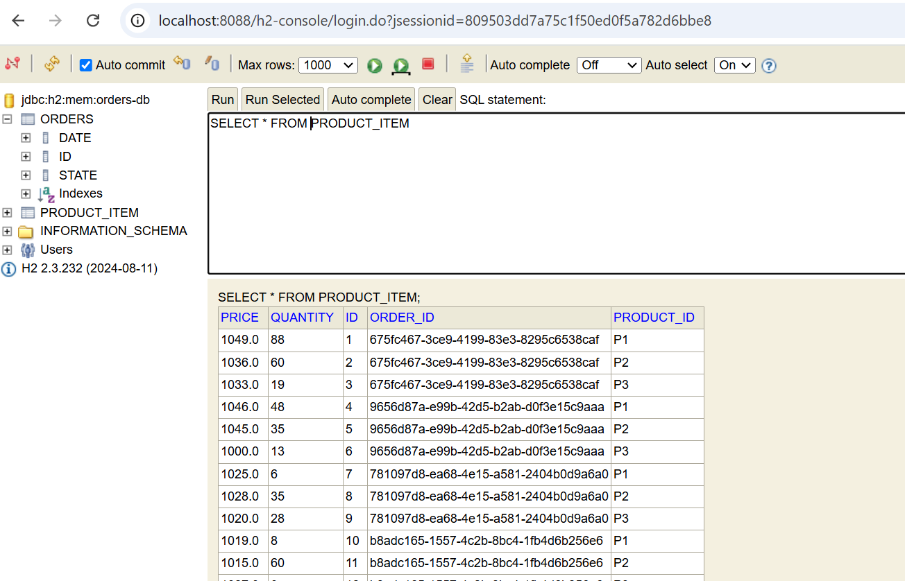

# Inventory Service Overview

The **Inventory Service** is a microservice that handles product management in a distributed system. This service provides CRUD operations for products and integrates key security features using OAuth2 and Keycloak for authentication and authorization.

## Entities and Repository

### Product Entity
The main entity in the Inventory Service represents a product with fields for:
- **ID**
- **Name**
- **Price**
- **Quantity**

The entity is annotated with JPA annotations for persistence.

### Product Repository
The repository interface extends `JpaRepository`, providing methods to manage products in the database.

## Security Configuration

The Inventory Service uses **OAuth2** for security, with **Keycloak** as the identity provider. The security configuration includes:

- **JwtAuthConverter**: A custom converter that extracts roles from the JWT token and converts them into Spring Security authorities.

- **SecurityConfig**: Configures the security filter chain:
  - Disables CSRF
  - Enables CORS
  - Sets session management policy to stateless
  - Configures the application to use JWT tokens for authentication

## REST Controller

The `ProductRestController` provides endpoints for managing products:

- Retrieve all products
- Retrieve a product by its ID
- Get the authenticated user's information

Some endpoints are protected by role-based authorization using `@PreAuthorize` annotations.

## Command Line Runner

The `CommandLineRunner` bean is used to initialize the database with sample products at application startup.

# Order Service Overview

The **Order Service** is responsible for managing orders in the system. It defines several entities and handles communication with other services.

## Entities

### Order
Represents an order with fields for:
- **ID**
- **Date**
- **State**

It has a one-to-many relationship with `ProductItem`.

### ProductItem
Represents an item in an order. It includes:
- **Product ID**
- **Price**
- **Quantity**
- A reference to the associated order

### OrderState
An enumeration defining the possible states of an order:
- **PENDING**
- **CONFIRMED**
- **CANCELED**
- **EXECUTED**

## Feign Interceptor

The **Feign Interceptor** is a critical component for inter-service communication. It intercepts outgoing requests and adds the JWT token from the security context to the request header. This ensures that requests to other services are authenticated.

## Security and Communication

- The **Feign client** is used for communication with other services.
- The interceptor retrieves the JWT token from the `SecurityContextHolder` and appends it to the `Authorization` header of outgoing requests.

# Authentication and Authorization with Keycloak

Keycloak is used as the Identity and Access Management (IAM) solution for securing the microservices. It provides OAuth2 and OpenID Connect (OIDC) capabilities, enabling Single Sign-On (SSO) and role-based access control across the application.

## Keycloak Setup

- **Realm Creation**: A realm is created in Keycloak to represent the security domain for the application.
- **Client Configuration**: Each microservice is registered as a client in Keycloak. This allows Keycloak to issue tokens for authenticated users and authorize requests based on roles.
- **User Roles**: Roles like `ADMIN` and `USER` are defined within the realm to manage permissions for accessing different parts of the application.

## Token-Based Security

- When a user logs in, Keycloak issues a **JWT (JSON Web Token)** containing claims about the user, including roles and other attributes.
- The microservices use OAuth2 Resource Server capabilities to validate these JWTs and grant access based on the roles embedded in the token.

## Securing Endpoints

Endpoints in the microservices are secured using annotations like `@PreAuthorize`, ensuring that only users with specific roles can access them. For example, only users with the `ADMIN` role can perform certain operations, while others are available to all authenticated users.

## Token Propagation with Feign Clients

Since the system follows a microservices architecture, communication between services occurs through Feign clients. To ensure secure communication:

- A custom **Feign Interceptor** is implemented to retrieve the JWT from the current authentication context.
- The interceptor adds the token to the `Authorization` header of outgoing requests, ensuring that downstream services can validate the request's authenticity using the same Keycloak-issued token.

This setup provides a robust security model with centralized authentication, flexible role management, and seamless integration of OAuth2/OIDC standards across the microservices.

# Summary of the Process

1. **Startup Initialization**
   - Upon startup, the Inventory Service populates the product database with initial data using the `CommandLineRunner`.

2. **Authentication and Authorization**
   - Security is enforced using OAuth2 and Keycloak. The JWT token is validated, and roles are extracted to control access to endpoints.

3. **Inter-Service Communication**
   - The Order Service communicates with other microservices using Feign clients.
   - The Feign Interceptor ensures that each outgoing request includes the JWT token for authentication.

4. **Role-Based Access Control**
   - Endpoints in both services are secured based on roles.
   - The `@PreAuthorize` annotation is used to specify required roles for accessing certain endpoints.

5. **CORS and Stateless Sessions**
   - The security configuration enables CORS for cross-origin requests.
   - Session management is configured to be stateless.

This architecture ensures that the microservices are secure, scalable, and capable of communicating effectively in a distributed environment.

